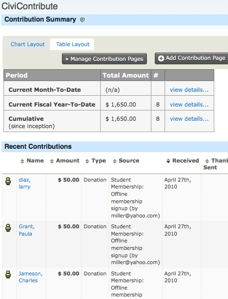
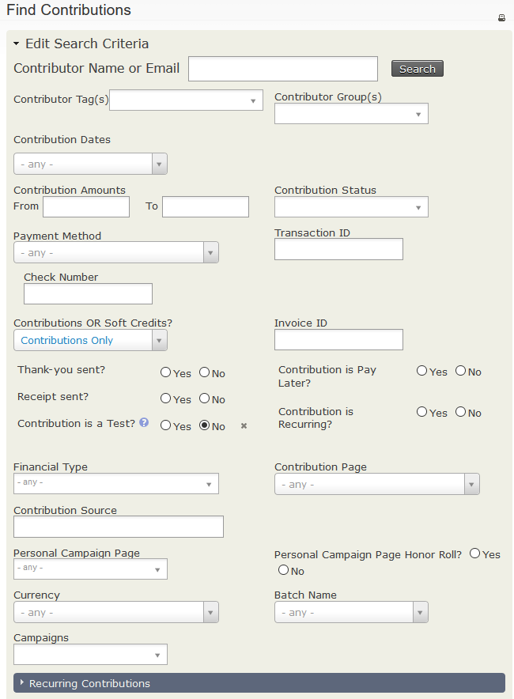

# Viewing the CiviContribute dashboard

The CiviContribute main page or dashboard summarises the contributions made,
including lists of contributions received in the current month to date, year
to date, and cumulatively since inception (i.e. all contribution records in
  your CiviCRM installation). This allows you to easily browse contributions
  that have been recorded automatically or added manually. The dashboard also
  provides buttons to manage and add contribution pages.

Different layouts are available for viewing summaries. The following screenshot
shows the most recent contribution to a campaign using the Table Layout tab:

You can also view bar or pie charts to compare contribution totals across
months of a given year and across years by clicking on the Chart Layout tab.

Finally, you can add any number of contribution report instances to your
personal CiviCRM Dashboard. These might include a bar chart summary of
year-to-date contributions by Financial Type or month, a list of the top 10
donors, etc. Refer to the _Reports_ section for details on adding reports
("dashlets") to your personal dashboard

# Finding contributio

Searching based on contribution data
------------------------------------

CiviCRM makes an important distinction between contributions and the
people that made the contributions. It is important to appreciate the
difference between the two when you are searching contributions. For
example, if you want to send a gift to all people that made a
contribution in the last year, what would be more appropriate? Contacts
or contributions? The answer depends on whether you want to send two
gifts to people that made two contributions and there is of course no
right or wrong answer - it just depends on your approach. It is
important to think about this each time to do a search.

The **Find contributions** search allows you to search based on
contribution data and return contribution records. The **Advanced
search** allows you to search based on some limited contribution data
(and combine that with other contact information) and return contacts.
You can also choose **contribution** from the **Display Results As**
column to show contributions rather than contacts.

Searching based on criteria gives you access to simple totals and also
the option to export as CSV for further analysis.

To View the Find Contributions screen, go to Contributions > Find Contributions

You can search based on a number of criteria, such as date range, amount,
 contribution status etc. Contributions must match all specified criteria in
 order to be returned, so the more criteria you enter, the narrower the search
 will be. For example, searching for the Financial Type "donation" and the date
 range "January 1st to May 31st" will return contributions that meet both
 criteria. Relative date ranges such as "Last Month" or "Last Year" are often
 quite useful.

The search criteria shown above are also available from Advanced Search, which
means you can get results as a list of contacts OR contributions. Advanced
Search allows you to save a query as a smart group - and you can also filter
your results with additional contact criteria including donor addresses and
demographics ("Show me all contacts who have contributed more than $100 last
year AND who live in California").

The results screen from a search displays the total amount for the results
returned for that search, the number of contributions, and the average amount
per contribution in addition to the subset of records resulting from the search:

You can select an action to perform from the - actions - menu once you select
all or a subset of records. The "actions" menu allows you to:
- **Update multiple contributions**: This is useful if you want to update a
large number of contributions' thank-you date at once, for example. You need to
[create the profile](../organising-your-data/profiles) you want to use *before*
you perform the search and batch update.

- **Delete contributions**: This removes contributions entirely from the
system, as if they had never been entered in the first place. Editing
contributions and updating their status to canceled provides a better audit
trail, but there may be situations where you do want to delete, such as a
contribution entered on the wrong contact's record.
- **Export contributions**: NOTE: This is an export of contibutions.  If you
choose to export multiple contributions from the same contact you will end up
with one row for each contribution in your export file. If you want to do
searches that return one result per contact, use the contact advanced search.

- **Receipts - Print or Email Contribution:** This allows you to create a PDF
file of all the receipts in the search, or email the receipts to the associated
donors. See "Sending thank you letters" below for more information.

- **Email - send now**: Send an email to all or selected contacts found in the
search.

- **Thank-you letters - print or email**: Create a custom PDF letter for each
of the contributions selected, with the option to update the receipt or thank
you date for each.

- **Update pending contribution status**: This allows you to record payments
details and to update the contribution status for all or selected online
"pay later" contributions. This action only works for contributions with the
status of Pending (Pay Later) and the same contribution status will be applied
to all the contributions selected for updating.
