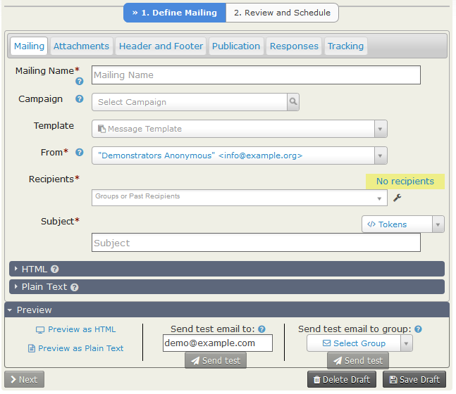
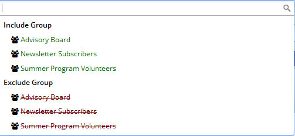
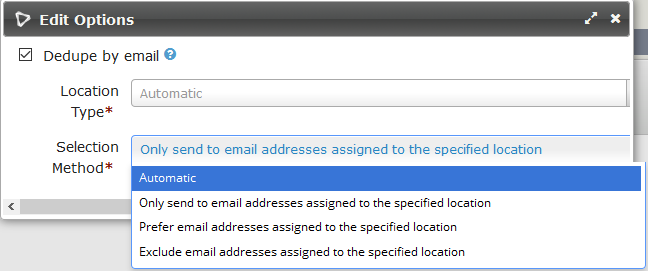
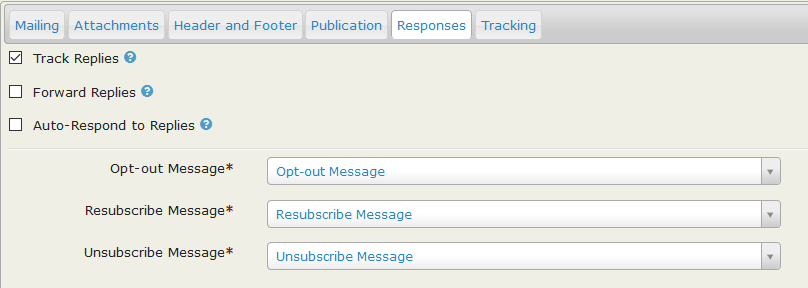
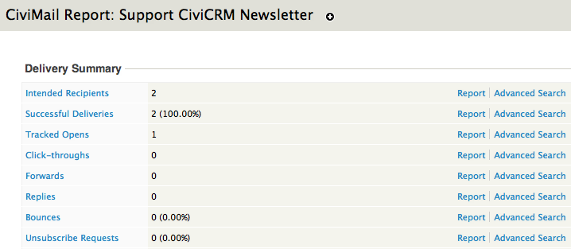
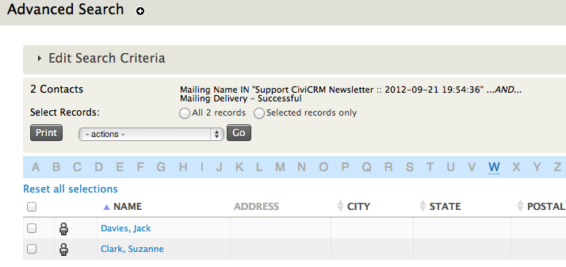

Everyday Tasks
==============

This chapter contains step-by-step instructions for performing important
everyday tasks with email.

Send an email to one person (with CC and BCC) 
-----------------------------------------------

You can use CiviCRM to send an email to individuals. Using CiviCRM for
this purpose is useful if you want other people at your organisation to
see the email or if you want to send an email based on a pre-defined
template.

1.  Find the person you wish to email. There are two common ways to do
    this:
    -   Use the Quick Search box on the top left. Click inside the box
        and begin typing a part of the person's name or email address.
        Choose the person from the choices that are presented.
    -   Navigate to **Search > Find Contact**. Enter part of the
        person's name or email address. Click Search and click on the
        person's name when it shows up on the search results screen.
2.  From the contact summary page, click **Actions > Send an email** or
    click the **Activities** tab and choose **Send an Email** from the
    dropdown menu.
3.  You can add additional recipients using the CC and BCC fields. 
4.  If you have templates defined, you can choose one from the Use
    Template dropdown menu. Selecting a template populates the text
    content and HTML content fields with the message content from the
    particular template you have chosen. You can then edit that
    content.
5.  Enter your content or add content to your template. If you just wish
    to send a Plain Text version of your email, ignore the HTML Format
    section and click on the Plain Text Format section. Enter your
    message in the box.
6.  Click **Send** to send your message.

To see the activity that was just recorded of the email sent, click the
Activities tab of the contact.

Sending a quick email to less than 50 contacts
----------------------------------------------

In the results from a search, CiviCRM makes "Send Email to Contacts"
available from the actions dropdown menu. This allows you to send an
email to more than one contact at a time. Sending an email this way is
relatively quick, but it provides no options for tracking email and
doesn't give contacts the option to opt out. It is bad practice to use
this method for mass mailings, which is why it is limited to 50
contacts. For mass mailings, use CiviMail.

1.  Click **Search > Find Contacts** (or **Advanced
    Search**). Choose your search criteria and click Search (or use
    any other search to find the contacts that you wish to email). 
2.  From the search results screen, choose some or all of the contacts
    and click **- actions - > Send Email to Contacts**.
3.  Follow the same steps as in sending an email to one person. 

Each of the recipient contacts will have this email recorded as an
Activity in their record. An activity will also be recorded for the
sender. The activity record will also list all the other message
recipients. Unlike with mass mailing (see below) there is no one place
where all emails sent via the Send Email function are listed. 

**Note:** If a message is sent to multiple recipients, each recipient
will see only their own email address in the To field. Because the
recipients don't see who else received the email, you might want to
mention whom you are sending it to in the text of your mail (for
instance: "TO: Members of the board, staff") 

Inserting an image in an email
------------------------------

Click the **image button** in the WYSIWYG editor. 

 

The Image Properties window will appear. Click **Browse Server** to look
for image files on your server. 

 
In the left sidebar, you will see a directory of files. If the image you
need is already uploaded to your server, navigate to it in the directory
and select it. If not, Click **Upload** to choose a file from your
computer. 

 
 
Your computer's file-browsing window will open. Find the image file you
want, 
click to select it and click **Open**. You can repeat this process to
upload multiple files to CiviCRM at once.

To insert, double click on the image you want. You'll return to the
Image Properties window of your email.

Here you can add adjust the size and alignment of the image and the
border around it. You can also fill in the Alternative Text field, which
is text that appears when the image is not available to the reader (if
they choose not to load images in their email client, or are using
a screen
reader due to a visual impairment). The alternative text ensures no
information is lost; it's a best practice to always include alt text for
images to make email accessible to all user communities. 

Click **OK** to insert the image. 

 

Sending a mass mailing through CiviMail
---------------------------------------

Using the Mailings functionality offered by CiviMail provides many
benefits over the Send Email activity, allowing you to track respondents
to your mailing, process bounces, and allow people to unsubscribe from
your mailings.

### Choosing recipients: Groups versus search results 

There are two ways to select the recipients for your mailing—sending to
existing Groups and sending to search results—and although the workflow
to create the mailings is mostly the same, there are two important
differences.

The first and most important is that when you're setting up Mailings to
send to Groups, you can save your work at any point and continue it
later. Mailings to search results cannot be saved for later editing;
when you start to prepare your mailing to search results, make sure you
have time to finish it. 

The other difference is that for mailings to search results, you are
required to choose a Group from the Unsubscription Group dropdown menu.
Here's why: Every mass mailing needs a way to track unsubscribe
requests. Mailings sent to Groups have this capacity built-in—the next
time a mass email is sent to that Group, anyone who has unsubscribed
will not be included. However, mailings sent to search results do not
have this built-in way to track who has unsubscribed, so you need to
provide one. 

Here's how it works: If a contact who matches your search results is
already unsubscribed from the Unsubscription Group that you designate,
that contact will not be sent the mailing. If a contact unsubscribes via
the unsubscription link in this mailing, they will be unsubscribed from
this Group and therefore not receive any more emails sent to this group.
This is true whether they were originally a member of the Group or not.

The Unsubscription Group you designate collects unsubscribe information
only; it does not supply any contacts to the mailing. In other words,
contacts who are in the Unsubscription Group but do not match your
search criteria will not be included in the mailing. (If you wish to
include these contacts you should include the relevant Group.)

For example: Your organization is having a big event next week. Several
emails have already gone out about it, but you have added many new
people to your database in the last week and you want to send them an
event announcement. You do a search for new contacts via **Search >
Custom Search > Date Added to CiviCRM**. This is the search that is the
basis of the mailing. Your organisation stores its event email list in a
Group called Event Alerts, so for this mailing, you would probably want
to choose that as your Unsubscription Group.

If you do not already have a Group that would be appropriate for the
Unsubscribe Group for a mailing you're planning, you may want to create
one and call it something like Miscellaneous Mail Unsubscribes. You
could then add that Group to other future mailings to ensure that the
people who have unsubscribed are excluded from those future mailings. 

### The Mailing set-up screens 

If you are sending mail to an existing Group, go to **Mailings > New
Mailing**.

If you're using search, perform your search (for example, using the
**Search > Advanced Search**) and then choose **Schedule/Send a Mass
Mailing** from the**- actions -** drop down.

The process for sending the mailing then proceeds via the following
screens. You can move between these screens by using the
**Next/Previous** buttons. For mailings sent to Groups, you can also save
your mailing at any stage by clicking on the **Save & Continue
Later**button.

### 

**Step 1: Define Mailing**

Fill out the following fields: 

You can also refine your recipient list by including and excluding
recipients of previous mailings.

For instance, you may want to resend an email only to contacts that have
been added to a Group since the last time you sent them email, to avoid
sending the same email twice to some people. In that case, choose the
original mailing in the EXCLUDE Recipients of These Mailing(s) area.
This will then send the message only to those members of the group who
did not receive the original mailing.

1. 
**Name Your Mailing:** Enter a name for this mailing. Select a name
that will allow you and others in your organization to clearly identify
the purpose of this mailing. It is recommended that you start each name
with a date (e.g., "2015/04/25 - Monthly Newsletter"). This will make it
easier to include or exclude recipients of this mailing in future
mailings. This name is for internal use only and will not be shown to
recipients. You will be asked to enter the Subject of the email later.

    **Note**: The message editing text area displays all text as Arial.
    However, the actual default is Times New Roman. You should change all
    text to your target font at the very end because future text edits often
    revert to Times New Roman.

2. 
**Template**: If you have made any templates, you can choose one to use
for this email. Selecting a template populates the HTML Format and
Plain-Text Format fields with the message content from the template. You
can then edit that content. You can also update the template, either
changing the original template or saving it as a new template.

3.
**From**: Select the sender email address for this mailing from the dropdown list.
Users with Administer CiviCRM permssion can add additional email addresses by going to 
Administer >> CiviMail >> From Email addresses. 

4. 
**Recipients:** This is where you can choose who will receive the
mailing (if mailing to Groups) or further refine your mailing (if
mailing to search results). You can choose Groups to include and
exclude, by selecting them from the "Recipients" dropdown. 
Please make sure your Group has a the type "Mailing List".

You can also refine your recipient list by including and excluding
recipients of previous mailings. For instance, you may want to resend an
email only to contacts that have been added to a Group since the last
time you sent them email, to avoid sending the same email twice to some
people. Choose the original mailing in the " Exclude Past Recipients From". 
This will then send the message only to those members of the group who did not 
receive the original mailing. 
    
You can see the estimated final number of recipients to right of the "Recipients" field and highlighted in yellow.

**Unsubscribe Group:** At the Define Mailing screen you can also specify
the group that contains all your contacts that have unsubscribed.
    
**Remove Duplicate Emails:** To edit your mailing dedupe options, click the small wrench 
to the right of the Recipients field.

CiviCRM will always dedupe your mailing based on unique contact records. For example, if a contact is in three of the groups you are including in your mailing, they will only be sent one copy of the email. However, if the same email is used by multiple contacts, that email address will receive multiple copies of the email—one for each contact using that address. Checking this box will ensure only one email is sent to each address automatically.

**Location Type:** You can change the Location Type and the Selection Method on the Edit Options screen. 
You can filter on the Location Type and only send the mailing to email addresses with the specified location type or exclude the email addresses with the specified location type.

5.  
**Composing your Email:**This section will allow you to compose content
for your mailing. As you write your content, remember that every email
will be sent individually. CiviCRM offers the ability to personalize
each email using tokens. See "*Using tokens in emails*" later in this
chapter.If you just wish to send a text version of your email, ignore
the HTML section and click on the Plain Text section. Enter your message
in the box.

6.
**Attachments:** You can attach documents and files to the email by going
to Attachments tab and selecting the file(s) you would like to upload.

7.
**Header and Footer:** On this tab you can select the header and footer
you would like to use for the mailing. You can define additional Headers
and Footers via **Mailings > Headers, Footers, and Automated
Messages** (See *Set-Up* for details).

8. 
**Publication:** There is only one field in this section:
**Mailing Visibility:** Its dropdown menu offers two options, "User and
User Admin Only" and "Public Pages." Choosing Public Pages makes this
content viewable as a web page by everyone who has the permission of
"View public CiviMail content."
"User and User Admin Only" means that only users that received the mailing 
or administrators can view the content of this email as a web page; 
the recipients will have to log in to be able to view the message.

**Make the mailing content available for the public:**
It is possible to view CiviMail mailings as a web page. For each sent mailing there is a permalink to view the mailing.The permalink to the sent mailing should be of the form ...

civicrm/mailing/view/?id=2&reset=1

... where you replace the "2" with the number of your mailing. When composing the message, use the "Mailing permalink" token {mailing.viewUrl} to generate this URL for you.

In order to make this link accessible to the public, you must grant "view public CiviMail content" permission to anonymous users or the user role you desire.

In addition, in the mailing creation process, there is a new token {mailing.viewUrl} which you can add in the header to generate the URL to view the content of this mailing. This is accessible from the dropdown of mail tokens as the value "Mailing permalink".

9.
**Responses:**
**Track Replies:** Checking this option will send replies from the
mailing's recipients to a CiviMail specific address instead of the sender's address 
so they can be stored within CiviCRM. 

Checking this box will open the two options described next.
    -   **Forward Replies:** This option is only visible if "Track Replies"
    is checked. You will need to check this option if you want the From
    address to also receive the replies sent by recipients.
    -   **Auto-respond to Replies:** This option allows you to send a
    specific automatic reply to anybody who replies to your mailing. You
    need to set up an autoresponder ahead of time in **Mailings >>
    Headers, Footers, and Automated Messages**.
    
In the same screen, you can also select the different automatic messages.
- ** Opt-Out Message:** This message will be sent to the recipient who has opted-out from all the mailing lists
- ** Resubscribe Message: ** This message will be sent to the recipient who has resubscribed to one of the mailing lists
- ** Unsubscribe Message:** This message will be sebt to the recipient who has unsubscribed from one of the mailing lists
You can edit these messages by going in **Mailings >> Headers, Footers, and Automated Messages**.

10.
**Tracking**
    -  **Track Click-Throughs**: This option will keep track of how many
    users and which users clicked on all the links in your message. This
    is accomplished by redirecting all links through your server. This
    means that all links will be overwritten with custom links
    containing your domain name.
    
    **Note for HTML mail:**Some phishing filters may mark links that are
    displayed differently in HTML code and in the text as unsafe. It is
    therefore best not to use something like <a href="http://google.com">http://Google.com</a> but rather <a
    href="http://google.com">click here to go to Google</a>.
        
    **Note for Plain Text email:**If you use short, user-friendly URLs
    in your email, they will all be overwritten with long links
    containing the name of your site and a long code looking like this
    http://yoursite.com/sites/all/modules/civicrm/extern/url.php?u=529&qid=29011.
    
    -   **Track Opens:**This option allows you to track how many people
    opened the email you received. However, there are limitations to the
    effectiveness of this method. If the recipient does not show images
    in their email client (often referred to as "blocking remote
    content"), their email will not be marked as opened even if they do
    open it. Blocking remote content is a very common practice.

**Step 2: Review and Schedule**

**Testing Your Mailing:** You can test your message in one of two ways:

1.
**Test Mailing:**You can specify an individual email address or a
    test group for your test mailing. The test mailing will fill in all
    the Tokens and include any attachments you are planning to send. 
     
    It is a good idea to test your email by sending it to yourself and
    viewing it in your email client to make sure it looks as you expect.
    If you are sending a mail with a complex layout, send it to your
    test group and verify it from various mail clients (see *Testing
    templates* in the *Set-up* section for more tips on this). It is
    preferable to have more than one person receive your test email and
    give you feedback.
    
2.
**Preview Mailing:**The preview will show you all the HTML
    formatting and converted tokens with your data. It will not include
    the attachment. There is no guarantee that all email clients will
    display the email exactly as it is shown in this preview, but it is
    useful to ensure things like font consistency, basic layout and
    color. 

**Schedule or Send**
This section will allow you to either send the email immediately or
schedule a date and time for it to be sent. By default, CiviMail checks
every 15 minutes whether an email is ready to be sent, so there can be a
delay of up to 15 minutes after you request the email to be sent.

Mailings sent to large numbers of recipients are sent in batches of
about 400 to avoid the emails being caught in spam filters. Therefore,
the actual sending of your mass mailing can take several hours depending
on your server configuration.

Tracking sent mass mailings
---------------------------

To review key statistics about mailings sent in the past, go to
**Mailings > Scheduled and Sent Mailings**. Once you have found your
mailing in the list, or searched for it using the filters above,
click **Report** in the "action" column. This will display basic
information on all of the tracked actions, including the number of
opens, link click-throughs or the percentage of bounces (see "Managing
bounces" below).

To expand on this information, click the name of one of the statistics
to display a list of the contacts to whom it applies, and various other
details such as the time the email was opened (tracked opens). Where a
mass mailing has been sent to a contact, you also view the "Bulk Email"
record of the mailing in the Activities tab of their profile.

Now you might want to filter this information further. For example, of
all the recipients who opened the mass email, you might only be
interested in those who are between the ages of 21 and 30, or registered
for a given event. Click "Advanced Search" next to a statistic to start
an advanced search with the email attributes pre-filled; e.g. if the
link next to "Tracked Opens" is clicked, the search fields will be set
to look for all contacts who opened the email, ready for you to add
extra criteria. For more information on advanced searches, see
"Searching".

Managing mass mailings
----------------------

Mass mailings can be found in one of three areas accessible via the
**Mailings** menu:

1.  **Draft and Unscheduled Mailings**: As soon as you name your message
    in Step 1 and click Next, it is placed in this area. If you click
    **Save & Continue Later** or simply abandon a message after some
    steps, you can continue working on it by clicking on the
    **Continue** link next to the message listed here.
    (**Note:** Mailings started based on search results will not have the
    Continue link listed.) 
     
    You can also **Delete** draft messages here.
2.  **Scheduled and Sent Mailings:**When you send or schedule a mailing,
    it will be placed in this area and remain there until it is archived
    or deleted. 
     
    You can track the success of delivery by clicking on the **Report**
    link next to the message. 
     
    You can also start another mailing based on a previous mailing by
    clicking on the **Re-Use**link. (Note, the Re-Use link is not
    available for mailings based on search results.) 
     
    The **Archive**and **Delete**links are available under the
    **more**link. For mailings that are scheduled but not yet sent, a
    **Cancel** link is available instead of **Archive**. 
     
3.  **Archived Mailings:** This area lists all messages that were
    archived from the Scheduled and Sent mailings area. Mailings listed
    here are not available to be included or excluded from the recipient
    list. 
     
    It provides exactly same functionality as Scheduled and Sent
    Mailings, including the possibility to view Reports and Re-Use. 

Using tokens in emails
----------------------

You can use tokens to insert personalized text (such as a person's
name), to add action links (such as an unsubscribe option), or display
standard organization information (such as domain address) into a mass
mailing sent with CiviCRM. Tokens are replaced by the appropriate value
at the time the email is sent out.

To view the list of available contact tokens, click on **Insert
Tokens**. For more information about tokens in general, see *Mail merge
functions (a.k.a. using Tokens)* in the *Working with Your Data* section
of this book. 

### Contact data tokens 

If you want each email to address the person by first name after "Dear,"
you would type a space and then click on **Insert Tokens** at the top
right of the HTML Format field. The popup that appears enables you to
find the appropriate token by typing "First name" in the box and choose
the token that corresponds. Click Close and you will see that your
message now reads "Dear {firstname}." When the email is sent, the
appropriate first name will be inserted into each message. Browse the
Inset Tokens pop-up for a complete list of contact data tokens,
including any of the custom fields that have been created for your site.
You can also refer to:
[http://wiki.civicrm.org/confluence/display/CRMDOC/Tokens](http://wiki.civicrm.org/confluence/display/CRMDOC/Tokens)
for more details. 

### **Action and Organizational Tokens** 

You can also insert action tokens, such as opt-out, unsubscribe and
forwarding tokens. These tokens insert links to take the specified
action; in order to display the links properly in HTML messages, you'll
need to add the proper link tags using the Source icon in the editor.

You can also insert standard organization information, such as "Domain
(organizational) address," which displays the address of your
organization as defined at **Administer > Communications >
Organization Address and Contact Info**. For a complete list of action
and organizational tokens, see:
[http://wiki.civicrm.org/confluence/display/CRMDOC/Tokens](http://wiki.civicrm.org/confluence/display/CRMDOC41/CiviMail+Action+and+Organizational+Tokens).

Note: You are required to include a token for either opt-out OR
unsubscribe, as well as the organizational (domain) address token in
every CiviMail mailing. These can be placed directly in the body of your
mailing body, or you can put them in the mailing header or footer. If
your organization has developed a standard mailing footer, just include
these tokens in the footer so that folks don't have to think about them
each time they create a new mailing.

In general, including click-able unsubscribe and opt-out links are a bit
friendlier for recipients (as opposed to the reply-to via email method).
You can also provide both options. More details at:
[http://wiki.civicrm.org/confluence/display/CRMDOC/Tokens](http://wiki.civicrm.org/confluence/display/CRMDOC/Tokens)

### Custom and Checksum Tokens 

Only contact fields, action links and organizational information can be
inserted in your email as tokens. Related records, such as the name of
the event for which the contacts have pending enrollments, cannot be
included. However, you can provide a link to the person's contact
dashboard so that they can review their registration details for
themselves (once logged in).

You can create and use a token for custom data fields that you have
created to store data about your contacts. You can also create a
checksum token that generates a unique URL for each contact so they can
modify their information without having to log in. See more information
about custom and checksum tokens, including how to construct URLs you
need, at
[http://wiki.civicrm.org/confluence/display/CRMDOC/Tokens](http://wiki.civicrm.org/confluence/display/CRMDOC/Tokens).

**Note:** In the HTML format editing area, tokens that generate URLs
(links) need to be placed in the URL field of the Link creation screen.
Otherwise, they will display as text and not a clickable link in the
email client of the recipient.
