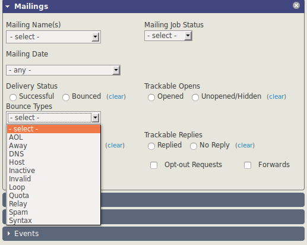

# Reports and analysis

CiviMail has a number of tools for reporting and analysis; indeed
reporting is one of the key reasons to use CiviMail.

## Individual mail reports

You can view a report for each individual mailing from the **Mailings >
Scheduled and Sent Mailings**. These reports are based on live
information about your data; you can track your emails in real time by
refreshing the page. Each mailing report is broken down into a few
sections. The availability of data is dependent on you enabling tracking
of the items when you set up your mailing. 

### Delivery summary

The delivery summary shows some high-level statistics about the mailing.
Clicking on the links in the Delivery Summary will show a list of the
contacts that took the action.

**Intended Recipients** shows the number of people that the mailing was
intended to be sent to. 

**Tracked Opens** shows the number of people that CiviCRM thinks have
opened the email *if you have chosen to track opens*.

**Note:** In the world of email, there is no 100% reliable way of
knowing when someone has opened an email. CiviCRM uses a trick that is
common amongst mass mailers &mdash; it embeds a small image with a unique name
in each email. When a client views the email and downloads the image,
CiviCRM knows that they have read the email. Because this technique is
common, to protect people's privacy, most email clients ask users to
confirm whether they want to download images in emails. Hence your
report really tells you the number of people who downloaded the images;
the actual number of readers is higher than the number reported. Tracked
opens statistics should be taken as indicative, rather than accurate. In
our experience, a 30% reported opening rate can be considered good. This
is obviously different for each organisation and each group you send
emails to.

Don't focus too much on the absolute numbers, but rather use them as a
way of comparing different mailings you send. You might want to use them
to experiment with different layouts, writing styles, and lengths and
see what works best for your constituents.

**Click-throughs** shows the total number of times that people have
clicked links in your email *if you have enabled click tracking*.

**Forwards** show the number of times people have forwarded the email
using the forward link (which is a token that you can include in your
mailing).

**Replies** shows the number of times that people have replied to the
email *if you have enabled reply tracking*.

**Bounces** show the number of email addresses that could not be
successfully delivered to *if you have enabled bounce processing*. 

**Unsubscribe requests** shows the amount of people that have clicked on
any unsubscribe links that you include in your email. 

## Managing bounces and contacts with invalid emails

If your server is set up to process bounces, contacts will be marked as
**On Hold** when their email bounces. Further messages to those
addresses will be suppressed. You can search for emails that are on hold
either from the Bounces report or with an advanced search, and then
investigate why the emails are bouncing.

You should review a list of bounces by clicking on the **Bounces** link
in the Delivery Summary. You can see the reasons for individual bounces
such as incorrect email addresses (e.g., contact@gooogle.com), fix them
and remove their On Hold status. You can then re-use the mailing and
simply add it to the EXCLUDE Recipients of These Mailing(s) list on the
Select Recipients screen of the re-used mailing setup.

In the Mailings area of **Search>Advanced search** you can search by
bounce type.

 

## Click-through summary

In this section, click-through statistics are shown for each link.
There are two statistics, **Clicks** (i.e., the number of times that a
link has been clicked) and **Unique clicks** (i.e., the number of people
that have clicked on links).

## Mailing reports with CiviReport

CiviReport has four reports, Mail Bounce Report, Mail Summary Report,
Mail Clickthrough Report and Mail Opened Report, which offer similar
functionality to what is described above. The major advantages of
looking at the reports via CiviReport (available from the **Reports**
menu) are:

-   You can run the reports for multiple mailings.
-   You have access to all the other cool features of CiviReport,
    including the ability to add reports to dashboards, get reports
    emailed, etc.

Read the *Reporting* section of this book for more information.

