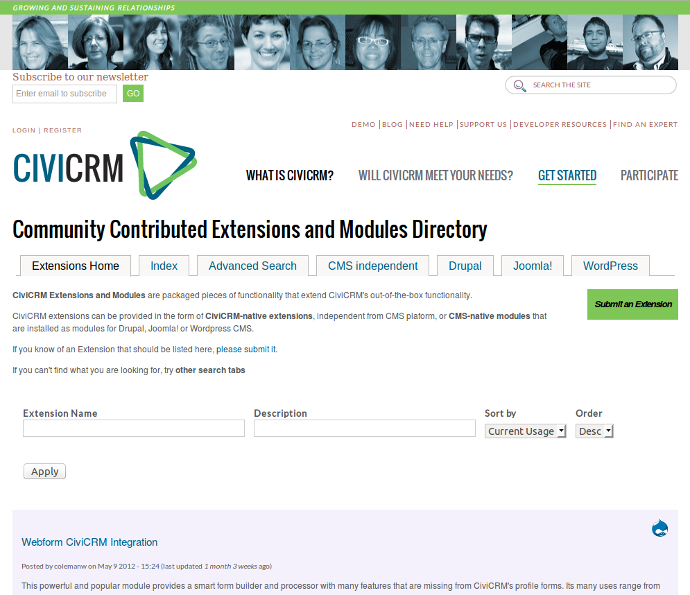
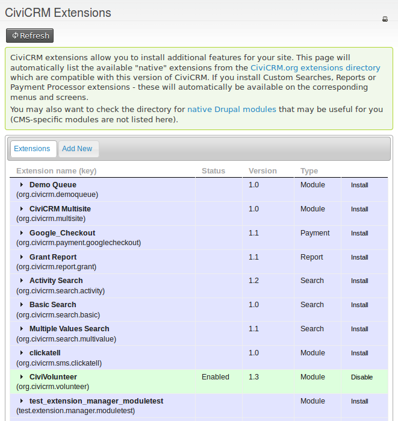

Extensions
==========

Extensions provide additional functionality to core CiviCRM. Extensions
are the recommended way to create new features and change the way that
CiviCRM works, especially when these changes are not needed or desired
by the entire CiviCRM community.

Many people write extensions for their *specific use cases* and install
them it on their CiviCRM installation. Many people write *generic
extensions* that are useful for multiple organizations. Extensions that
are useful to multiple organisations can be published in the CiviCRM
extensions directory. 

The extensions directory
------------------------

The extensions directory is available at
[https://civicrm.org/extensions](https://civicrm.org/extensions). It
lists extensions that have been written by members of the CiviCRM
community and made freely available for download by other
organizations. Extensions are by default listed in order of popularity
(which is calculated by the number of sites that report using the
module).

 

Extensions are organized into two broad categories: 'native' extensions
which work with any CMS, and CMS specific extensions that add
integration between CiviCRM and the CMS and hence are CMS specific. If
you are familiar with your CMS, you may know CMS specific extensions by
another name, for example Drupal specific extensions are typically
called **Drupal Modules** and Wordpress specific extensions are called
**Wordpress Plugins**.

Extensions that have been approved for automated distribution can be
easily installed directly from your CiviCRM installation. 

Installing extensions
---------------------

When configured correctly, extensions can be installed directly into
CiviCRM via the user interface. Go to **Administer > System Settings >
Manage Extensions**. You should see a list of extensions that are
compatible with your version of CiviCRM. Note that you may not see all
the extensions that were listed in the extensions directory as they may
not be compatible.

If you do not see a list of extensions here, it may be that your system
is not properly configured to manage extensions. You should consult your
system administrator if this is the case. 

Writing extensions 
--------------------

Anyone is free to write an extension to enhance their CiviCRM
installation (or commission someone to do so). Writing an extension is
a task for a developer so a detailed discussion of how to write one is
outside the scope of this book. If you do write an extension to cater
for your particular use case, you may wish to consider if other
organizations would also be able to benefit from your work and hence
whether you should publish your extension and make it more generic.
Publishing your extension and attracting users brings many benefits in
the shape of feedback on how it can be improved, bug reports, and code
contributions that may enhance your extension. 

