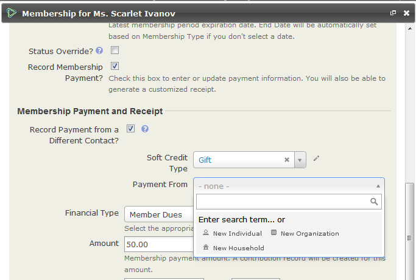

# Manual entry of memberships

Although CiviCRM provides a tool set allowing website contacts to
self-serve and become members without intervention required on the part
of office staff (which can be very powerful and save organisations a lot
of administration time), there are many situations when memberships need
to be processed manually. This chapter describes the various ways in
which office staff (or any appropriately permissioned users) can
manually create and process memberships, including: 

-   Creating new membership records one by one (including gift
    memberships where the payment comes from a different contact) 
-   Batch data entry of members 
-   Importing Memberships

## CiviMember Access Control

As with other CiviCRM functions, Administer > User & Permissions >
Permissions allows you to control access to various CiviMember features.

-   For users who need to find and view memberships - assign the
    **access CiviMember** permission, the **view contributions**
    permission if payments are involved and make sure the user has view
    contact permissions for the associated record. 
-   For users who need to create and/or edit membership records - assign
    the **edit memberships** permission, the **edit contributions**
    permission if payments are involved and make sure the user has edit
    contact permission for the associated contact record.

More details on permissions can be found at
[http://wiki.civicrm.org/confluence/display/CRMDOC/Default+Permissions+and+Roles](http://wiki.civicrm.org/confluence/display/CRMDOC/Default+Permissions+and+Roles)
. 

## Creating a New Membership Record

You can create a new membership record in a couple ways, by looking at
an existing contact's record, or through the Memberships menu. Using
the membership menu is useful because you can create a new contact at
the same time as adding the new membership record. 

An advantage of creating a new membership record directly from an
existing contact's record is that if you have set up a payment processor
that allows credit card transactions directly on your site, you may
select the **Submit Credit Card Membership** option and process the
membership payment immediately.

When you use the **Memberships** menu to create a new membership, you do
not have the option to submit credit card information, but can still
have the option to record other types of payments like checks and cash.

### Via an existing contact record

-   From a contact's record, click the **Memberships** tab then
    click **Add Membership**. If you have set up a payment processor that
    allows credit card transactions directly on your site, you can
    select the **Submit Credit Card Membership** option and process the
    payment immediately.

 

Many of the fields on "New Membership" form will be auto-completed if
left blank. Fields include:

-   **Membership Organization and Type:** select the name of the
organization that the contact has a membership with and the type of
membership ***OR*** 

-   **Choose Price Set**: If you have various fee structures for different classes of memberships, you can use [Membership Price Sets](/membership/membership-price-sets.md) by selecting Choose Price Set (rather than Membership Organization and Type).

-   **Number of Terms:** enter the number of membership periods or terms
associated with this membership record. The membership end date will
then be set to an end date for this number of terms (this option is
hidden when using membership price sets) 

-   **Source**: if left blank the system will complete details regarding the
record, including whether it was an offline or online transaction and
who completed the record.

-   **Campaign**: if the membership is connected with a larger campaign,
select the name of the campaign. To learn more, see the *Campaign*
section.

-   **Member Since**: the date the membership record was created will be
auto-filled, but can be overridden if necessary.

-   **Start Date**: if the membership type is a rolling membership, the
current date will be auto-filled. If the membership type is a fixed
period, CiviCRM will determine the appropriate start date based on the
membership type configuration. This can be overridden if necessary.

-   **End Date**: this field is automatically calculated from the start date
and filled in based on the membership type settings. This can be
overridden if necessary.

-   **Auto-renew**: this field is only shown if you have chosen a
Membership Type that has auto-renew functionality set in the Membership
Type and are using the Submit Credit Card Membership option to create
the Membership.

-   **Status Override?**: check this box to manually define a status for the
membership record. As indicated by the title, it overrides the status
automatically provided.

    !!! caution
        This setting will stop the status from automatically updating based on the membership status rules you have set up when [defining your memberships](/membership/defining-memberships.md).

-   **Record Membership Payment?**: by checking the box and completing the
transaction fields displayed, you will record the money paid for the
membership. This creates a contribution record in addition to your
membership record. After recording the membership, you will be able to
view the membership record and see the related contribution record at
the bottom.

    -   **Record Payment from a Different Contact?**: this is often used for
        Gift memberships.
    -   **Financial Type**: select the appropriate financial type for this
        payment. 
    -   **Amount**: enter the amount of the membership payment.
    -   **Received Date and Time**: enter the date and time the payment was
        received.
    -   **Paid By**: select the payment instrument in which this payment was
        received, such as cash or check. You can learn more about
        configuring Payment Instruments in the *Contributions* section.
    -   **Check Number**: if the payment was received by check, enter the
        check number.
    -   **Transaction ID**: if you have a payment processor, CiviCRM will
        store an auto-generated transaction id. For manual transactions,
        you can enter a bank transfer ID or other identifier as applicable.
    -   **Payment Status**: select the status of the membership payment
        received. You can learn more about configuring Payment Instruments
        in the *Contributions* section.

-   **Send Confirmation and Receipt?:** check this box to send an email to
the contact that their membership is confirmed

    -   **Receipt From:** select the email address the confirmation receipt
        is from. If the email address you want to use is not listed, you
        can add it by going to**Mailings > From Emails**.
    -   **Receipt Message:**you can enter text here to send a special
        message to the member. If you don't enter text, the default
        confirmation and receipt message will be used.

### Auto-renew Memberships via Back end

To manually create a membership that will auto-renew go to the contact's
summary screen, select the **Memberships**tab and click on **Submit
Credit Card Membership**. If you select a Membership Type that is set up
for recurring, a checkbox labelled **Membership renewed automatically**
will be exposed.

If you check Auto-renew, a recurring payment (subscription) request will
be submitted to the selected payment processor. If the request is
successful, this membership will be automatically renewed on the last
day of the membership period until the recurring payment is cancelled.
Membership payment receipt emails will include a link for the member to
cancel the auto-renewal.

### Via the **Memberships** menu

-   Navigate to **Memberships** **> New Membership**, then select the
    contact or create a new contact. 

-   Fill out the New Member form with the appropriate membership and
    payment information as in *Via an existing contact record* above.

 

## Gift Memberships

When you enter a membership manually you can select **Record Payment
from a Different Contact?** to record the membership as a gift from
someone else. The person paying for the membership (gifter) can be an
existing or a new contact created during the process. The payment will
be recorded on the gifter's record with a soft credit for the membership
on the gift recipient's record. The receipt will be sent to the gifter.
You will need to send a separate email or letter to tell the gift
recipient about their membership. 

## Entering batches of membership payments

CiviCRM offers a **Batch Data Entry** feature (found in the
**Memberships** menu) that can be used for entering batches of
membership payments that have been received into the office on paper
forms, or similar. It can be used for new and existing contacts and
includes verification of the total amount and count of items against the
payments you’ve recorded on your deposit slip(s). 

This feature has a batch entry grid input screen, which has a couple of
tools that you can use to speed up processing when you have a lot of
memberships to process at the same time. It includes a copy feature to
set all fields to the same value, and allows you to create new contacts
without leaving the batch entry screen. 

The fields of information that you want to collect in the batch entry
input grid for Batches are determined by several CiviCRM reserved
profiles. If you want to collect other kinds of information that are
not currently included in these profiles, you will need to alter these
profiles to reflect the fields you want to display.

You can read more details about the *Batch Entry of Contributions or
Membership Payments* feature in the *Set-Up* chapter of the
*Contributions* section. 
 

## Importing Memberships 

The **Importing Memberships** feature is very useful if you have a large
set of membership records that comes from a source outside of CiviCRM.
This feature can also be used to update large numbers of existing
memberships with new information.

!!! tip "See also"
    The [Importing Data](/common-workflows/importing-data-into-civicrm.md) page explains the import process generally, and also has a section specifically on [importing memberships](/common-workflows/importing-data-into-civicrm.md#import-memberships).

-   Contact records must exist before you import membership data. If
    you want to import membership data for contacts that do not yet
    exist in CiviCRM, you will first need to import the Contact data.
    Make sure the contact data has an External ID so you can include
    this External ID with your membership data to associate these
    records with the related contacts. If you are importing membership
    data for contacts that already exist, then you will need the
    Internal Contact ID or the fields from your Unsupervised Duplicate
    Matching Rule to associate the related membership data with the
    correct contact.
-   Your import membership data file MUST contain both Membership Type
    and Start Date. The membership types listed must exactly match the
    membership types set up by your CiviCRM Administrator. The start
    date should use the date format specified for your CiviCRM
    installation. If your import file does not contain these fields then
    you will not be able to import it. 
-   You must import membership data for different contact types
    separately. Importing files with more than one contact type will not
    work. (You must import new memberships and renewals separately
    also.) 

Now you are ready to import your membership data:

1. 
Navigate to **Memberships > Import Memberships**.
1. 
On the Upload Data screen:

    -   Select your import data file. It must be a CSV file. 
    -   Select the checkbox if your source data contains column headers. 
    -   Specify the contact type you are importing. 
    -   Indicate what date format you are using.
    -   Click **Continue >>**.
1. 
On the Match Fields screen, map your membership data with the
appropriate CiviCRM fields under the Matching CiviCRM Field column.
Note that you can **Save this field mapping** so you can re-use this
mapping for future imports. 
1. 
On the Preview screen, you will see the preview of the results of your
import. There is a table that lists the Total Rows in the uploaded file,
the number if rows with errors and the number of valid rows. If you
continue with the import, the rows with errors will be skipped. You can
download a file with just these problem records and continue with the
import. You can then edit the errors and do another import with them.
Alternatively, you can fix the errors in your original CSV file and
start the import again.
1. 
If there are no errors or you don't want to correct the found errors,
click **Import Now>>**. You will be shown the progress of the
import until it is complete. When the import is complete, you will see a
summary of the import activity and its results. 

