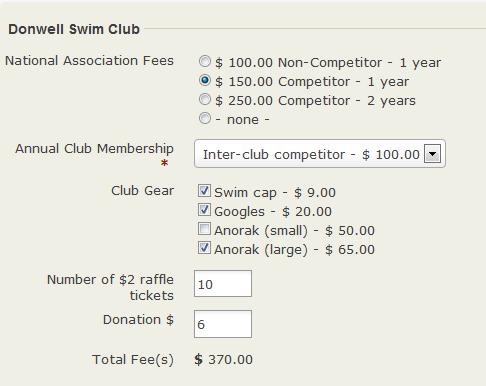
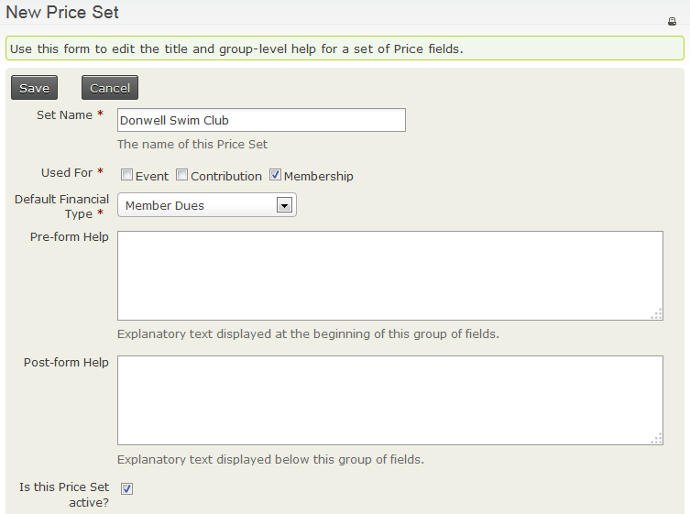
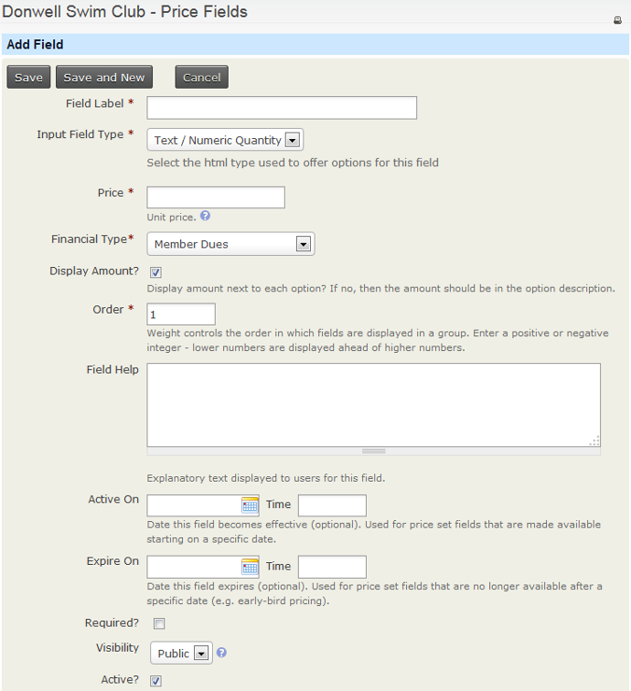
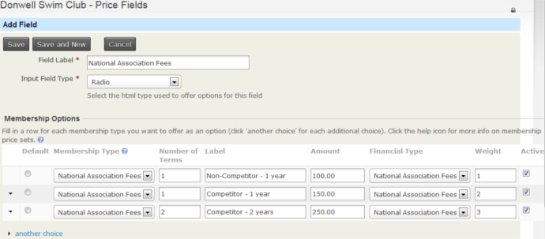
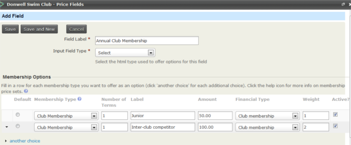
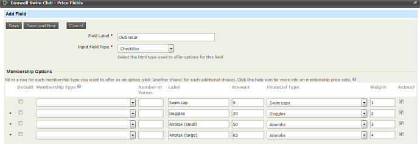
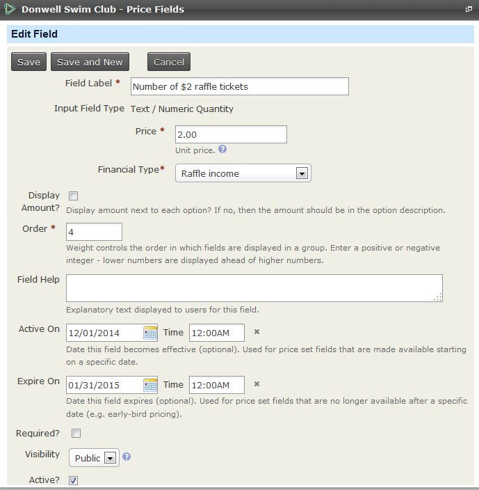
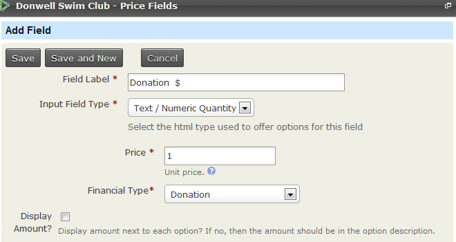
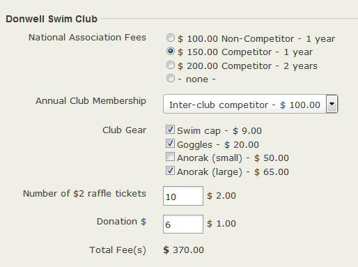

# Membership price sets

This chapter describes how to configure membership price sets so that
your contacts can:

-   Sign up for multiple membership terms at the same time. 
-   Sign up for more than one membership in a single transaction ( e.g.
    National and local memberships).
-   Select non-membership options such as information booklets when they
    sign up for a membership.

Here's an example of how a membership price set that offers all these
options could look: 

 
 

The Donwell Swim Club **price set** consists of five **price fields**:
National Association Fees, Annual Club membership, Club Gear, raffle
tickets and donation. 
 
It offers two membership types:

 
 

These membership types must be defined before you create the price set.
(Refer to *Defining Memberships* chapter.) 

You must also have defined all the financial types you will need before
you can create the price set. (Refer to the *Contributions* section for
information on financial types)

Membership price sets can be used in online join up or renewal pages or
for new member sign ups processed manually through the CiviCRM back
office system. However, they cannot be used for renewals that are
processed manually. Each membership must be renewed individually (see
the *Renewals* chapter) and in addition you may need to create a
contribution price set consisting of the non-membership items you offer.
Also, you cannot combine memberships that can be auto-renewed with
memberships that do not offer auto-renewal or with non-membership items.

Price sets can be configured in many ways and you should always test a
price set thoroughly before using it on your live site to make sure that
you have configured it in the way that fits your situation best.

## Creating a New Price Set

 

1.  Navigate to**Memberships > New Price Set** or**Administer****>
    CiviMember > New Price Set**.
2.  Enter the price **set name**. This name will be displayed both to
    the public as part of the price set and to admin staff when they
    need to choose between price sets, so make sure it is descriptive
    enough for both purposes.
3.  Tick **Membership**
4.  Set the**Default Financial Type**.****The choice you make has
    accounting implications and you should refer to the *Contributions*
    section for more information.
5.  Add pre- or post-form help text if you want to.
6.  Make sure the price set is active and **Save.** 

You will be taken to a form to create the first **price field** for your
**price set.**

 

### Creating a New Price Field

1.  Enter a name in the **Field Label**. This name will be displayed to
    the public.

2.  Select the **Input Field Type**. There are 4 input types available
    for price sets:****

    -   **Text/Numeric Quantity:** allows you to set a unit **Price**.
        When the price set is displayed it shows a text box where a
        quantity can be entered. The quantity entered is multiplied by
        the unit price to calculate the amount.

    -   **Select:** displays a dropdown box where one option can be
        selected.

    -   **Radio:** displays multiple options in a list; up to one option
        can be selected.

    -   **Checkbox:** displays multiple options in a list; multiple
        selections are allowed.

    Each of the input types will be used in an example in this chapter. 

3.  **Financial Type** will be set to the **Default Financial Type**
    chosen when this price set was created. You can override this value
    if required.

4.  **Display Amount?** This displays the price of the option next to
    the label. If your field label includes the option price then this
    can be unticked. Otherwise it should stay ticked.

5.  **Order**, **Field Help**, **Required**and **Active** are either
    self-explanatory or have adequate help provided on the form.

6.  **Active On** and **Expire On** can be set so that the price field
    is not visible until the **Active On** date, not visible after the
    **Expire On**date or is only visible between the******Active On**
    and **Expire On**dates**.**For example you could use these fields to
    bring in a price rise at 12:00am on 1 January 2015 by setting the
    price field with the old prices to **Expire On** 1/12/2015 12:00am
    and the price field with the new prices to be **Active On**1/12/2015
    12:00am.

7.  **Visibility**can be set to **Public** (visible on your website to
    those who can see the membership sign up page) or **Admin** (visible
    only through the back end and then only to users with appropriate
    permissions). 

## Multiple membership terms

The configuration for the National Membership price field illustrates
how you can allow contacts to sign up for multiple membership terms at
the same time and shows the **Radio** input field type. 

 

In the **Membership Type** field you select the option you want from
a dropdown list of all the membership types you have configured. When
you select a specific membership type the **Number of terms**auto-fills
with 1 and the **Label**, **Amount** and **Financial Type** are
auto-filled based on the definition of that membership type. All those
values can be changed as needed. The National Association Fees
membership type has a duration of 1 year with a minimum fee of $100.
Setting the **number of terms** to 2 will give 2 years of membership.
The **Label** will need to be changed if you have more than one option
as each option must have a different **Label**. The **Amount** can be
can be increased to any value you want. This lets you offer a concession
and standard fee for for the same number of terms. 

As we have not included the price of each option in its **Label** we
would need to have **Display Amount?** ticked.

Defining a price field in this way will reduce the number of membership
types you need to create. You only need a 1 year National Association
membership type with a minimum fee of $100 for this price field instead
of three membership types. However you need to be aware that your
members will not be able to auto-renew if you use this type of
multi-term configuration. 

## Membership of more than one organisation

In addition to the National Association Fees, contacts are required to
sign up for a membership with the swim club. The **Select** input field
type has been chosen for this field. 

 

Again, when you select a specific membership type from the drop down
list the **Number of terms**auto-fills with 1 and the **Label**,
**Amount** and **Financial Type** are auto-filled based on the
definition of that membership type. You can change any of these values
as desired.

As we have not included the price of each option in its **Label** we
would need to have **Display Amount?** ticked. 

The combination of the two price fields described so far will let
someone sign up for a minimum of 1 and a maximum of 2 memberships.
Remember the two memberships will need to be linked to two different
organisations as a contact can only have one active membership with a
specific organisation. (See the *Defining memberships* chapter for more
information.)

## Non-membership Price fields 

You can also configure price set fields to offer additional services,
subscriptions or other non-membership options. 
 
 There are three non-membership price fields in our example. The first
offers a selection of club branded swimming gear. The **checkbox** field
type lets people choose more than one item from the options offered.

 

As these are products rather than memberships the **Membership Type**
and **Number of Terms** fields are left empty. You set the **Label**,
**Amount** and **Financial Type** for each option. 

As we have not included the price of each option in its **Label** we
would need to have **Display Amount?**ticked. 

If you look back at the screen shots of the three price fields discussed
so far you should notice that they all contain the same fields even
though are for three different input field types. **Radio** and
**Select** input types are interchangeable, both allow you to choose
just one option and can be used for membership or non-membership
options. **Checkbox**es must be used if your contacts are allowed to
choose more than one option from a single price field. They also can be
used for either membership or non-membership options.

The fourth input field type is **Text/Numeric Quantity** and it can only
be used for non-membership options. With this field type you usually
include the **unit price** of the item on offer in the **field label**
as shown in the following example or in the **field help**. This means
that **Display Amount?** should not be ticked.

This will display as:

This price field will only be visible between the **Active On** and
**Expire On**dates and lets us make sure that the raffle tickets can
only be purchased during the selling period authorised by the relevant
licensing authority.

The final price field is configured to allow people to give a donation.
Notice that the **unit price** is 1 and it is not included in in the
field label although the currency symbol is. The **Display Amount?** is
not ticked. This is the best configuration to allow "any amount"
donations. 

For review, here again is how all of these fields look on the final
screen:

 
