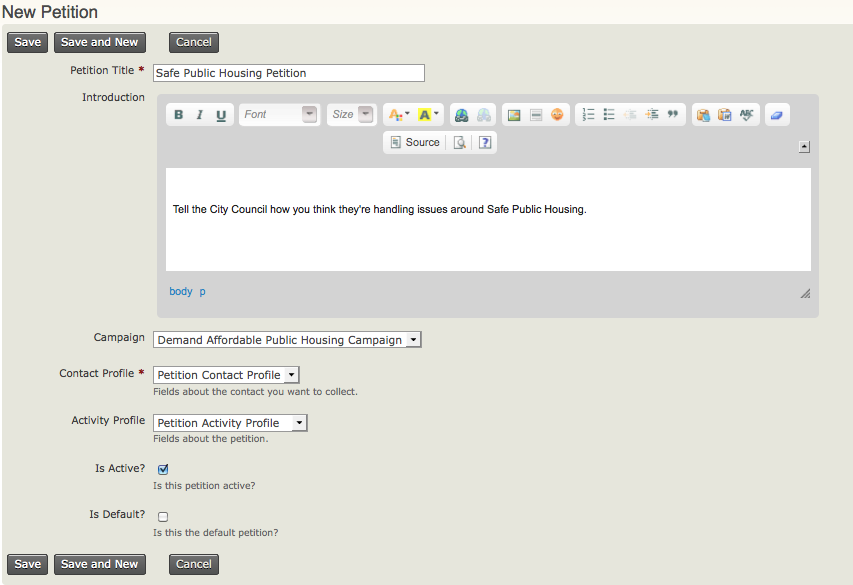

Set-up
======

This chapter describes the steps needed to set up a petition.

The CiviCampaign component must be enabled before you can use Petition.
See the section *Campaign* for information about this.

Set Drupal permissions
----------------------

For Drupal sites, you will need to set the appropriate Drupal
permissions so that specific roles can sign the petition, particularly
anonymous users if you're planning to make the petition public.

1.  Go to Drupal Adminstration page and go to the Permissions page (if
    you don't see the Drupal Administration menu, then you do not have
    appropriate permissions to do this).
2.  Under **Civicrm**module area check the permission boxes: **Sign
    CiviCRM Petition, Profile Create,**and**Access all Custom Data,**
    for the roles you require. For example, if this is to be a public
    petition, you must check these boxes for anonymous users and
    authenticated users.

To learn more about setting Drupal permissions, go to the Drupal
documentation at [http://drupal.org.](http://drupal.org.)

Create two Custom Profiles
--------------------------

In order to create a new petition, you must create two custom profiles:
one to capture the contact information of the signer, and the other to
capture the responses to the petition questions. The responses to the
petition questions are recorded in the activity record of type Petition
for each individual who signs the petition.

1.  Go to **Administer > Customize Data and Screens > Profiles** and add
    a profile with fields for the contact information you want to
    collect, such as First Name, Last Name, and Email. You may want to
    make some of these fields required so you capture enough information
    to communicate with signers at a later date. Note: you must collect
    at minimum an email address in the contact profile, because the
    Petition feature will send an email to the signer of the petition to
    prompt them to verify their email address. Only those verified email
    addresses can be counted.
2.  Go to **Administer > Customize Data and Screens > Custom Fields** and
    add a set of custom fields to capture responses to the petition
    questions. From the **Used For** drop down menu select **Activities**. For
    the **Activity Type** select **Petition Signature**.
3.  Under **Administer > Customize Data and Screens > Profiles** add a
    profile for the petition responses. Select **Activity** from the Field
    Name drop down menu, then select from the custom fields you created.
    

For both profiles, you may want to select the following settings in the
**Advanced Setting** area:

-   For **Drupal user account registration option?**, select the radio
    button for **No account create option** if you do not want all
    petition signers to have a Drupal account created.
-   For **What to do upon duplicate match**, you can select the radio
    button for **Allow Duplicate Contact to be Created** if you don't
    want anonymous users to update an existing contact record's
    information; you will then need to periodically dedupe records.

To learn more about how to create custom field sets, see the chapter
*Creating Custom Fields* in the *Organising Your Data* section. To learn about how to
create a custom profile, see the *Profiles* chapter.

Create a New Petition
---------------------

Once you have created the two profiles, you are ready to create a
petition.

1.  Go to **Campaigns > New Petition**, then enter the following
    information about your petition: 

 -   **Petition Title** (required): enter the name of your petition.
 -   **Introduction**: enter text describing what your petition is
     about. Potential signers will read this, so create a good message
     to encourage individuals to sign the petition.
 -   **Campaign**: if your petition is one strategy or activity of a
     campaign, then select the name of the campaign.
 -   **Contact Profile** (required): select the name of the profile
     that will collect the contact information of petition signers.
 -   **Activity Profile**: select the name of the activity profile that
     will collect petition responses.
 -   **Is Active?:** check this box to make your petition active.
 -   **Is Default?**: check this box to make your petition default.

1. 
Click **Save** to save the petition information.

