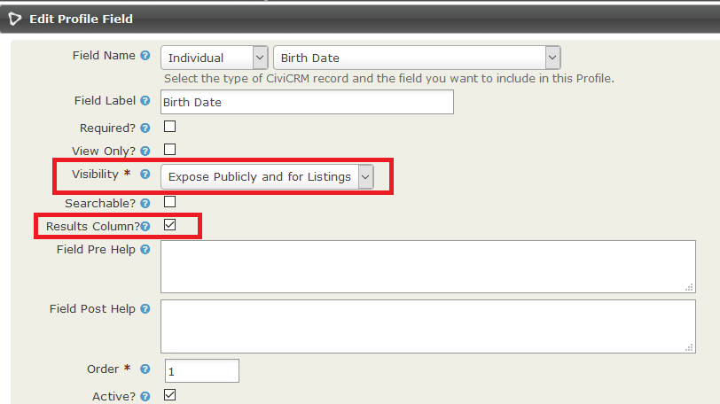
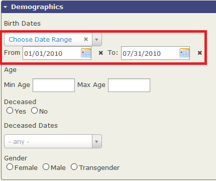
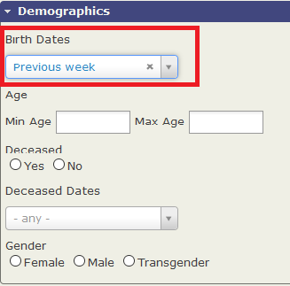
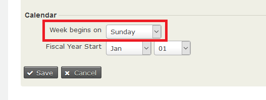
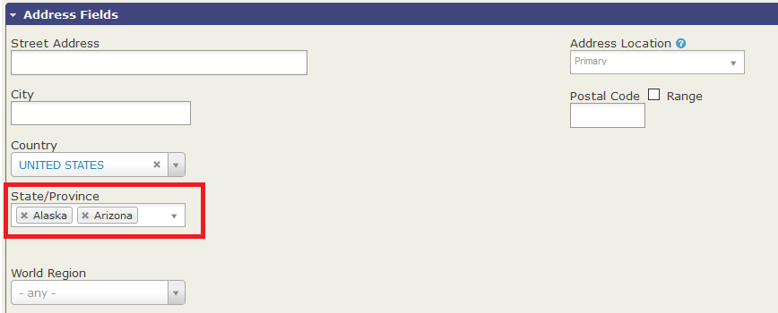
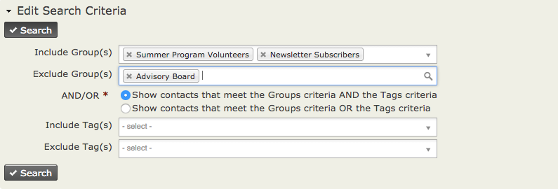

# Searching

This chapter covers different ways to find information you've stored in
CiviCRM. Two of the techniques in this chapter - finding contacts and
the "search-action" workflow, described in the second bullet below - are
core functions in CiviCRM, so most, if not all, users will find this
chapter helpful.

We will start off with some simple searches and then move on to more
advanced techniques. CiviCRM beginners should be familiar with
Quicksearch, Advanced Search and the component searches. More advanced
users should also look at reports, custom searches and Search Builder.

There are three main reasons to search:

-   To find a specific contact: the Quick search box can find contacts
    by name, email address or a variety of other characteristics.
-   To perform an action on a contact or contacts that meet certain
    criteria: a common workflow in CiviCRM, called a search-action, is
    to find contacts that meet certain criteria and then perform an
    action on them. For example, you might want to find all contacts in
    the advisory group in order to invite them to a meeting, find all
    those whose memberships have recently expired to send a renewal
    reminder, or find all contacts aged under 25 in a specific location
    to send them an email about an upcoming event nearby.
-   For ad-hoc reporting.

As a form of ad-hoc reporting, searching is often useful but does have
limitations. For example, you can't group results by particular
criteria, summarize, or easily produce graphs of the results. For more
advanced reporting, see the *CiviReport* section.

## Quick search

The easiest way to find a specific contact is to use the Quick search
box that appears in the navigation menu at the top left of the screen. You may choose to search by one of several criteria. Once you click in the box you can start typing immediately to use the default Name/Email search or you can click again to expose several other criteria in a dropdown selection list. Contacts that match the phrase you enter will appear in a dropdown list below the box. For example, if you are searching with Name/Email and you have left
automatic wildcard enabled then going to **Administer > Customize Data and Screens >
Search Preferences** entering "peter" will find:

-   people who's first or last name is **Peter**
-   people who have Peter appearing as part of their name, e.g. Mary
    **Peter**son
-   people who have Peter as part of their email address, e.g.
    blue**peter**@gmail.com  
-   organisations with Peter in their name, e.g. Al**peter**
    Community Centre.

You often don't need to type the full name of the person - just the first few
letters.  However, if you don't see the contact you are looking for, either refine the search by typing more characters, or hit the 'Return' key to convert your search into an Advanced search.

Quick search displays up to 10 results (by default). You can change the number of results returned from the *Search Preferences* screen described above by changing the *Autocomplete Results* setting.

CiviCRM also allows for the collection of a nickname when entering new contacts.  For example, "Joe" can be a nickname for "Joseph" and "IBM" can be a nickname for "International Business Machines".  When you first install CiviCRM you will find "Joseph" when searching for "Joe" and you'll find "International Business Machines" when searching for "IBM".

You can change this behavior from the *Search Preferences* screen described above by changing the *Include Nickname* setting to *yes*.

Note: If you search by **phone** then you will need to enter the digits of the phone number without any formatting. The **phone** search is done against a field that consists only of digits with all non-numeric characters stripped out.

Note: If you want to search by **first** and **last** name, use the format "Lastname, Firstname", not "Firstname Lastname".  For example, "Peterson, Mary" not "Mary Peterson".

## Advanced search

Advanced search allows you to search across all the information you have
about your contacts. For example, you could find "all contacts in
Venezuela" or "all advisory group members". If you specify two or more
categories of information, the search displays every contact that
matches all the categories. For instance, you can combine the two
criteria just mentioned to find "all advisory group members in
Venezuela".

The Advanced search screen is accessible from the navigation menu
**Search > Advanced Search**. On this screen, search criteria are
grouped into sections which refer to different types of data that you
can search on, such as address data, notes and information from
components such as Contributions or Events. Each group of criteria is
shown as a blue bar (known as an "accordion" because it expands when you
click on it). For example, if you want to search for all people in your
database from 16 to 18 years old, click on the Demographics accordion.
When it opens, you can specify the birth date range you are interested
in.

#### Display Settings For Results

Advanced Search returns your results as Contact records by default.
However, you may want to get another record type instead. For example,
you may want to search on the Membership renewal activity to find
everyone who renewed their membership last week then display the results
as Memberships so that you can export name, address and Membership
expiration date to create and then post out membership cards to those
contacts. Simply select the record type you want from the **Display Results As** dropdown.

#### Views for Display Contacts

Advanced search allows you to change the columns displayed in your
search results. The default columns are Name, Street Address, City,
State, Postal Code, Country, Email and Phone. If you want to display a
different set of columns (perhaps to include a custom field or remove a
column you don't need), create a Profile with the Search Views option
selected. Make sure that the fields in this Profile are set to "Expose
Publicly and for Listings" visibility, and are marked as Results Columns.
(For more information about creating Profiles, which are described in
detail in the Profiles chapter in the Configuration section.)

For example you may want to include columns for Gender and Date of Birth, while eliminating Country.
Create a profile that includes birth date, gender and address fields.

Read more about creating profiles in the Profiles section of the chapter
on *Organising Your Data*.

Combining this feature with the "Batch Update via Profile" action
provides a powerful method of viewing and updating a specific set of
fields across a batch of contact records.

### Search settings
The Search Operator determines whether your criteria are combined with AND statements, or combined with OR statements. For example, you may want to find all individuals who are in the Volunteers group AND who have a Volunteer Training activity recorded for them. In this case use the AND operator. If you need to find everyone who is in the Volunteers group OR has a Volunteer Training activity recorded, use the OR operator.

The Search in Trash allows you to search contacts that have been deleted but not deleted permanently. When a contact is deleted, the contact and all related data are moved to trash. Only users with the relevant permission will be able to search in trash and will be able to restore the contact from trash.

### The Date Range Filter

Most component searches include a date range filter. The images below
show examples of both:

-   by using an absolute date range, e.g. "1st Jan 2010" to "31 July
    2010"
-   by using a relative date range, e.g. "Previous week"

Relative date ranges are especially useful for searches that you would
like to then save as Smart Groups (automatically populated groups that
are configured to include contacts that share a certain set of
characteristics or activities). For more information see the *Groups and
tags* chapter.

For example you may want to use a relative date range search to find:

-   Contacts who have contributed in the last 7 days (Relative date
    range - "From 1 Week ago")
-   This (financial) years registered Event Participants (Relative date
    range - "This Year")
-   Contacts who are a certain age

Relative dates filters based on the time interval "week" assume that Sunday is the first day of the week.   This is not true in all countries, for example Europe and many countries in Asia/Pacific region consider Monday to be the first day of the week. To set which day is the first day of the week, you need to go to **Administer >> Localization >> Date Format**.

#### **Combining search criteria**

Different criteria are combined by "ANDing" them. For example, if you
select the tag "major donor" and the country "Mexico", the search will
return major donors from Mexico. The search will not return major
donors who are *not* from Mexico, nor those from Mexico who are *not*
major donors.

You can change the default search operator from AND to OR in the Search Settings.

Within criteria groups that allow you to check boxes for more than one
value, these options are also combined by "ANDing". For example, if you
can search for contacts whose Preferred Communication Method is both
Email *AND* SMS.

With fields that allow you to select more than one value from a dropdown list,
the values are always combined with "OR". For example, you could find contacts
that live in Alaska or in Arizona.

## Search Builder

Advanced search lets you choose from a wide range of criteria in a
user-friendly panel, but this has limitations. Search builder allows you
to define your own search and arrange the criteria according to your
specific needs.

Search Builder allows you to choose from a range of operators:

| Operator  | Purpose | Example |
| -- | -- | -- |
| = | Equals. Matches on the exact value you specify | **"First Name" = "Bob"** will find contacts who's first name is exactly "Bob" |
|  ≠  | Not equals. Matches on everything that is not the specified value. | **"Gender" ≠ "Female"** will find contacts who are not female |
|  > , ≥  | Greater-than, greater-than-or-equal-to | **"Birth Date" ≥ "Jan 1 2000"** will find contacts born on or after Jan 1 2000  |
| < , ≤ | Less-than, less-than-or-equal-to | **"Last Name" < "J"** will find contacts whose name starts with a letter that comes before J in the alphabet  |
| In | Value is one of those you specify | "Group" In "Board Members, Staff" will find contacts who are in either of the specified groups |
| Like| Same as the = operator, but supports the % wildcard character | **"Last Name" Like "Gree%"** will find contacts whose last name begins with "Gree" (Green, Greenberg, etc)  |
| Regex | Same as the = operator, but supports all regular expression operators. See http://en.wikipedia.org/wiki/Regular_expressions | **"Middle Name" Regex "[a-c]"** will find contacts whose middle initial is A, B or C  |
| Is Empty, Not Empty| Empty means the field exists and is equal to the number zero or contains nothing.  | **"City" Is Empty** will find all contacts who do have an address but the city was left blank  |
| Is Null, Not Null | Null means the field does not exist or contains nothing.  | **"City" Is Null** will find all contacts who do not have an address at all  |

Search Builder also allows you to combine criteria with multiple AND and
OR groups. To AND criteria (which means to find results matching all
criteria specified), click **Another search field** and enter criteria
under **Include contacts where**. To OR criteria (which means to find
results matching either one OR the other criterion), enter one
criterion in **Include contacts where** and the other under **Also
include contacts where.** The following example will search for females
born after Jan 1 2000 OR members of the Administrators or Advisory Board
groups:

Your search results will contain each contact's name, plus a column for
each search criteria you've defined. If you export search results, the
export file will contain those same columns.

Just like other searches, you can choose from a list of actions to apply
to the results of your search. If you export results, you can select
fields for export. Note that the fields you searched on will get
exported by default in addition to those you select.

You can also save your Search Builder search as a Smart Group. For more
information on Smart Groups, see the *Groups and Tags* chapter.

## Full-text Search

You can use this to search for text values all fields of the database.
This is particularly useful, for example, if you can remember specific
words that you have used but can't remember where you have put them. For
example, lets say that you recorded an activity with a contact and added
specific words to the description but have now forgot the contact's
name. You can use Full text search to find the contact and activity by
words that you remember from the description.

## Component searches

Most CiviCRM components offer a search on the data they maintain, such
as **Find contributions**, **Find members**, etc. These forms work in a similar
way to **Advanced search** but return rows of the main objects associated
with the components, instead of contacts. **Find Members** returns
memberships, **Find Participants** shows event registrations, **Find
Contributions** returns contributions and so on.

Each component search has its own Action list. See the *Component*
sections for more details.

Note that you can also use the Advanced search in conjunction with
**Display Results As** to search for component objects based on criteria
available in advanced search. For example, you could find all event
attendances from contacts that are also members.

## Custom searches

Custom searches are designed to answer specific questions that can't be
easily answered using **Advanced Search** or **Search Builder.**

Go to **Search** > **Custom Search** in the navigation menu and look at
the list of available custom searches.These customized searches have
been written by members of the CiviCRM community to meet their own
needs, and then contributed back to the community to share with others
who need the same or similar custom searches. It's worth spending some
time exploring these searches as some may be useful to you, and they
will give you an idea of the sorts of things that are possible. Though
some of these searches can be done in the Advanced Search (especially in
later versions), custom searches are also set up to display results
according to your search and may provide more useful columns in the
results for your needs. Here's a short description of the custom
searches available.

### Finding contacts in one group but not in another

This is probably the most popular custom search.

When using Advanced Search, if you select several groups in the Group
list near the top, it will treat the search as an OR search, and return
results for contacts who are in any of the groups you select. If you
want to find contacts who belong to all of the selected groups, you will
need to use Search Builder.

There is also a very useful built-in custom search, "Include/Exclude
Contacts in a Group/Tag", that enables you to find contacts who are in
one group but not in another, which you can find by going to **Search >
Custom Searches** in the navigation menu.

By combining Include and Exclude options, you can find contacts who are
in one group but remove just the group members who fit another
criterion. For example, you may want to find all the contacts who are
Newsletter Subscribers or volunteers, but exclude members of Advisory
Board, perhaps to create a new mailing list to receive a message
targeted at the most external circles of your constituents.

### **Household Name and State**

Search households in a state or province.

Note: which states or provinces are available in the search depends on
your localization settings. Add additional countries by going to
**Administer** > **Configure** > **Global Settings** >
**Localization**. Add to the column of "Available States and Provinces",
but note this change will also affect profile forms which include
country or state/province fields.

### **Contribution Aggregate**

Find aggregate totals of contributions from contacts within a range of
dates.

### **Postal Mailing**

Search for contacts in a given group and display results with mailing
information. Use this search to batch update contact information, send
an email, export contacts, or other actions.

### **Proximity Search**

Search for contacts located within x miles/kilometres of a specific
geographical area.

1.  Go to **Search > Custom Searches > Proximity Search**
2.  Enter the distance in miles or kilometres.
3.  Enter the country within which you want to search.
4.  Enter any other parameters you wish to give your search.
5.  Click **Search**.

**TIP:** You can also incorporate Proximity Searching in a profile which
you've configured for use as a search form.

### **Event Aggregate**

Search on event-related payments for a given event or event type in a
given date range. You may also limit results to show credit card
payments only or payees only. See also event reports for more useful
event search options.

### **Activity Search**

Find activities using any or all of the activity-related criteria. This
is also possible in Advanced Search by using Display results as.

### **Price Set Details for Event Participants**

Get detailed information about which participants opted for which
different paid options related to an event. For example, see who paid
just the event fee, who paid for the additional workshop and who paid
for dinner.

### **Find Contribution Amounts by Tag**

Search on any tag for contributions within a range of dates.

### **Zip Code Range**

Find contacts in a specified zip code or postal code range. This is
useful for targeted mailings or conducting surveys in a particular
geographical area.

1.  Go to **Search > Custom Searches > Zip Code Range**.

2.  Enter the start and end range of the zip or postal codes.

3.  Click **Search**.

### **Date Added to CiviCRM**

Search for contacts that have been added within a particular time
period. Including a group displays just those added within the specified
time frame who are also in that group. Excluding a group removes those
group members from the results.

### **Custom Group Multiple Values Listing**

A search for multi-value custom data.

### **Contributions made in Year X and not Year Y**

Search for contributions that have been made in one year but not
another. This is useful for following up semi-regular donors and
encouraging them to donate more regularly. See also the LYBUNT and
SYBUNT reports.

None of the fields are required; you can choose whether to search a
specified amount range as well as a time period, and whether you want to
exclude minimum or maximum amounts.

It is possible to write your own custom searches, but you'll need to be
comfortable with MySQL and PHP. See the Developer wiki at
[http://wiki.civicrm.org/confluence/display/CRMDOC/Develop](http://wiki.civicrm.org/confluence/display/CRMDOC/Develop)
for more information about how to do this. If you create a custom search
that you think could be useful for others, consider contributing it back
to the community.

## The 'search-action' workflow

After you retrieve your search results, you can perform a number of
actions. An Actions box appears above the results. You can select either
all records or specific records, then carry out an action with the
selected records. Different actions are covered in more detail in the
chapter on Everyday Tasks.

Some of the most commonly used actions are Add Contacts to Group, Export
Contacts, Map Contacts, and creating and printing Mailing Labels. (To
use Map Contacts, you will need to configure Mapping and Geocoding. You
can read more about this in the *Installation* chapter of the
*Configuration* section of this manual).

For example, to send email to a selected number of contacts, mark the
contacts you are interested in and then select **Send Email to Contacts** in
the dropdown list of actions.

## The contact summary pop-up

You can see a pop-up box with detailed information for any contact
listed in your search results by hovering over the contact icon in the
left column, as shown below. You can adjust the fields shown in this
"pop-up view" by modifying the fields included in the "Summary Overlay"
profile (**Administer** > **Customize Data and Screens** >
**Profiles**).

## The wildcard (%)

Understanding wildcards greatly expands your search options. A wildcard
represents any character (letter, numeral or punctuation mark). In
CiviCRM, the wildcard is represented by the % symbol (you may be
familiar with other symbols such as * from other applications). It is
most easily understood through examples.

Suppose that somebody asked you to find a contact with a first name
similar to "Michael", but possible something different such as
"Michelle" or "Michał". If you search for "Mich%" you will find all
these variations, including a contact who is supposed to be named
"Michael" but whose name was misspelled as "Micheal". Wildcards can be
used before, after, or even within words. For example, searching on
'Mich%el' will exclude "Michał" and "Micheal" but still find "Michelle"
and "Michael".  

## Case sensitivity

Note that when you search for character strings, the search is not
case-sensitive. For example, if you search for 'brooklyn', the search
will return strings with capitalised letters if the string exists, e.g.
'Brooklyn' or 'BROOKLYN'. Entering "mi%el" in lowercase will also find
contacts with an upper case 'M' in their name.
